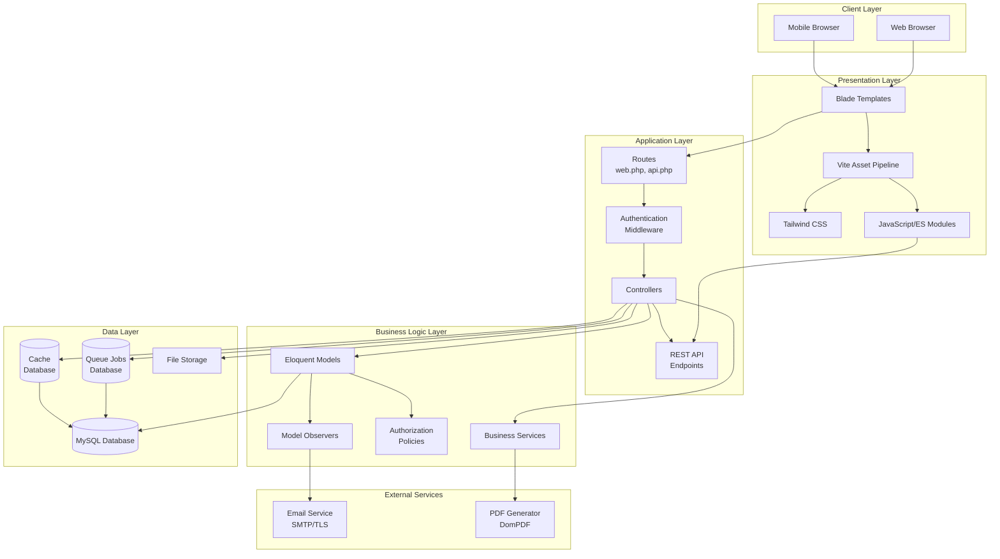
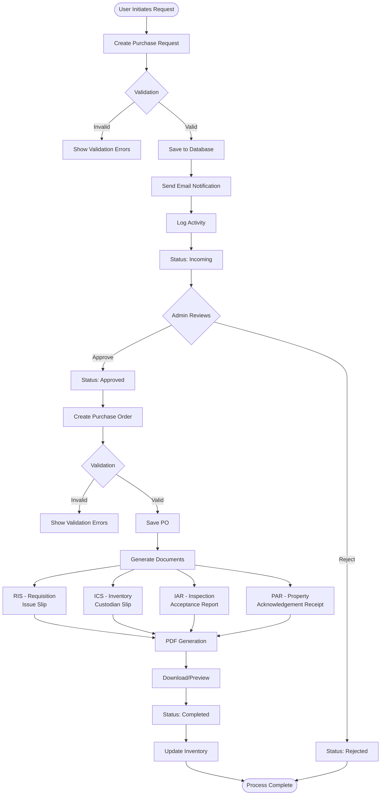
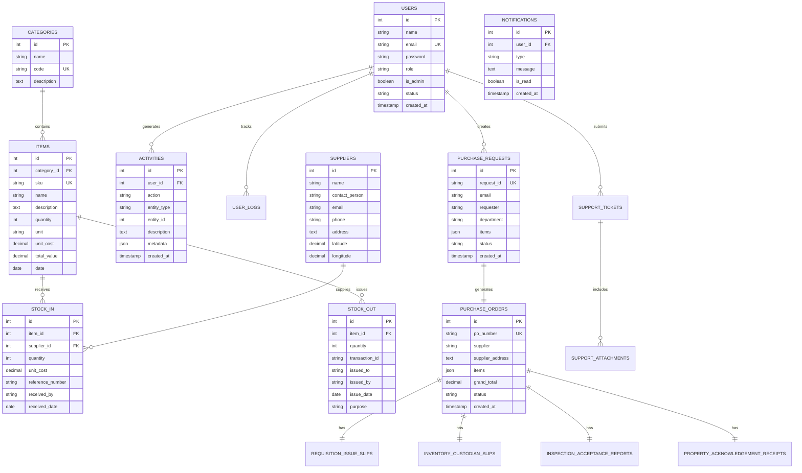
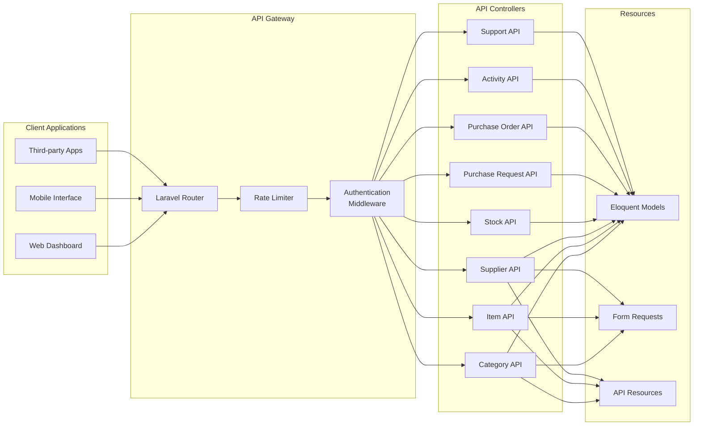
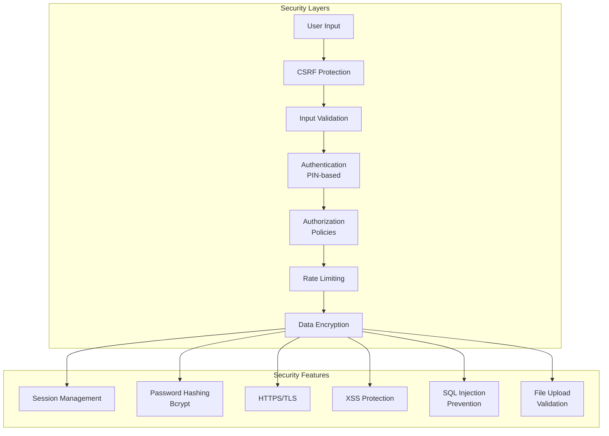
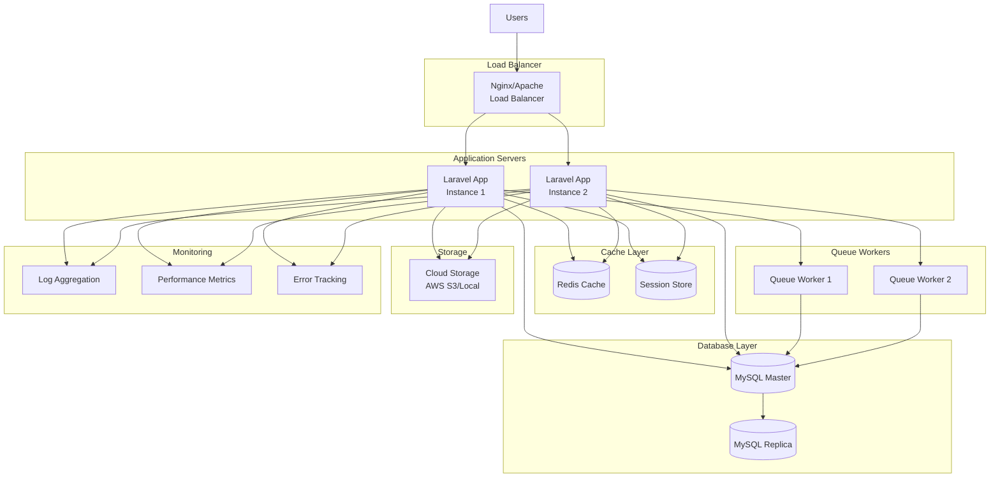

# System Architecture

## Overview

The Supply and Property Management System (SPMO) is built on Laravel 12 with a modern frontend stack, designed to handle inventory management and procurement workflows for Camarines Norte State College.

---

## High-Level Architecture

---

## System Components

### 1. Client Layer

- **Web Browser**: Desktop users accessing the admin dashboard
- **Mobile Browser**: Mobile-responsive interface for on-the-go access

### 2. Presentation Layer

- **Blade Templates**: Server-side rendering with Laravel Blade
- **Vite**: Modern asset bundling and hot module replacement
- **Tailwind CSS**: Utility-first CSS framework (v4.x)
- **JavaScript**: Modern ES modules, Axios, XLSX, html2canvas, jsPDF

### 3. Application Layer

- **Routes**: Web routes and API routes with middleware
- **Authentication**: PIN-based login with rate limiting
- **Controllers**: Handle HTTP requests and responses
- **REST API**: JSON API for AJAX operations

### 4. Business Logic Layer

- **Models**: Eloquent ORM models with relationships
- **Observers**: Event listeners for model lifecycle
- **Policies**: Authorization rules for resources
- **Services**: Reusable business logic

### 5. Data Layer

- **MySQL**: Primary relational database
- **Cache**: Database-backed cache storage
- **Queue**: Asynchronous job processing
- **File Storage**: Document and attachment storage

### 6. External Services

- **Email Service**: SMTP with TLS encryption
- **PDF Generator**: DomPDF for document generation

---

## Procurement Workflow Architecture

---

## Database Entity Relationship Diagram

---

## API Architecture

---

## Security Architecture

---

## Deployment Architecture (Production)

---

## Technology Stack Details

### Backend

- **Framework**: Laravel 12.36.1
- **PHP Version**: 8.2.12
- **Database**: MySQL
- **ORM**: Eloquent
- **Queue**: Database driver (can be upgraded to Redis)
- **Cache**: Database driver (can be upgraded to Redis)
- **Session**: Database driver

### Frontend

- **Template Engine**: Blade
- **Build Tool**: Vite 7.2.2
- **CSS Framework**: Tailwind CSS 4.1.17
- **JavaScript**: Vanilla JS with ES modules
- **HTTP Client**: Axios 1.13.2
- **PDF Client**: jsPDF 3.0.3
- **Excel**: XLSX 0.18.5
- **Canvas**: html2canvas 1.4.1

### Third-party Services

- **PDF Generation**: barryvdh/laravel-dompdf 3.1.1
- **Email**: SMTP with TLS
- **Testing**: Pest PHP 3.8

### Development Tools

- **Package Manager**: Composer 2.8.12
- **Node Package Manager**: npm
- **Code Quality**: Laravel Pint
- **Testing**: Pest PHP
- **Database Migrations**: Laravel Migrations
- **Seeding**: Laravel Seeders/Factories

---

## Key Design Patterns

### 1. MVC (Model-View-Controller)

- **Models**: Eloquent ORM for database interaction
- **Views**: Blade templates for UI rendering
- **Controllers**: Handle business logic and HTTP flow

### 2. Repository Pattern

- Controllers interact with models
- Business logic separated from data access

### 3. Observer Pattern

- `PurchaseRequestObserver` for status change notifications
- Automatic email sending on model events

### 4. Policy Pattern

- Authorization logic separated from controllers
- Centralized access control

### 5. Factory Pattern

- Model factories for testing and seeding
- Consistent test data generation

### 6. Service Layer

- Reusable business logic
- PDF generation services
- Email notification services

---

## Scalability Considerations

### Current Setup (Single Server)

- Suitable for: 100-500 concurrent users
- Database: Single MySQL instance
- Cache: Database-backed
- Queue: Database-backed

### Medium Scale (Multi-Server)

- Suitable for: 500-2000 concurrent users
- Load balancer with 2-3 app servers
- Dedicated Redis for cache and sessions
- Dedicated queue workers
- Database replication (master-replica)

### Large Scale (Cloud-Native)

- Suitable for: 2000+ concurrent users
- Auto-scaling application servers
- Redis cluster for cache
- Managed database service (RDS)
- S3/Cloud storage for files
- CDN for static assets
- Microservices architecture (future consideration)

---

## Performance Optimization

### Application Level

- **OPcache**: Enabled for PHP bytecode caching
- **Config Caching**: `php artisan config:cache`
- **Route Caching**: `php artisan route:cache`
- **View Caching**: `php artisan view:cache`
- **Query Optimization**: Eager loading to prevent N+1 queries

### Database Level

- **Indexing**: Primary keys, foreign keys, frequently queried columns
- **Query Optimization**: Use of `select()` to limit columns
- **Connection Pooling**: Persistent connections

### Frontend Level

- **Asset Bundling**: Vite for optimized builds
- **Lazy Loading**: Images and components
- **Minification**: CSS and JavaScript
- **Browser Caching**: Versioned assets

### Caching Strategy

- **Config Cache**: Application configuration
- **Route Cache**: Route definitions
- **View Cache**: Compiled Blade templates
- **Query Cache**: Frequently accessed data (when using Redis)

---

## Monitoring & Logging

### Application Logs

- Location: `storage/logs/laravel.log`
- Channels: Single, Stack, Daily
- Levels: Debug, Info, Warning, Error, Critical

### Activity Tracking

- User actions logged to `activities` table
- Entity types: PurchaseRequest, PurchaseOrder, etc.
- Includes metadata and timestamps

### User Logging

- Login/logout events
- IP addresses and user agents
- Session tracking

### Error Tracking (Recommended)

- Sentry integration for production
- Real-time error notifications
- Stack trace analysis

---

## Security Measures

### Authentication

- PIN-based login system
- Session-based authentication
- Password hashing with Bcrypt (12 rounds)
- Account status verification

### Authorization

- Role-based access (admin/user)
- Policy-based authorization
- Route middleware protection

### Input Protection

- CSRF token validation
- XSS prevention (Blade auto-escaping)
- SQL injection prevention (Eloquent ORM)
- File upload validation

### Rate Limiting

- Login: 5 attempts per minute
- Password reset: 3 attempts per minute
- Account setup: 5 attempts per minute
- API: 60 requests per minute (configurable)

### Data Protection

- Session encryption (configurable)
- Secure cookie settings
- Environment variable protection
- Database connection encryption (configurable)

---

## Future Enhancements

### Short-term (3-6 months)

- [ ] Redis implementation for caching
- [ ] Queue worker with Supervisor
- [ ] API rate limiting per user
- [ ] Advanced search and filtering
- [ ] Export to Excel/CSV
- [ ] Barcode/QR code generation

### Medium-term (6-12 months)

- [ ] Mobile application (React Native)
- [ ] Real-time notifications (Pusher/WebSockets)
- [ ] Advanced reporting and analytics
- [ ] Automated backup system
- [ ] Multi-tenant support
- [ ] API versioning

### Long-term (12+ months)

- [ ] Microservices architecture
- [ ] Machine learning for demand forecasting
- [ ] Blockchain for audit trail
- [ ] Integration with accounting systems
- [ ] Multi-language support
- [ ] Advanced workflow automation

---

**Document Version**: 1.0  
**Last Updated**: November 17, 2025  
**Author**: Supply System Development Team

