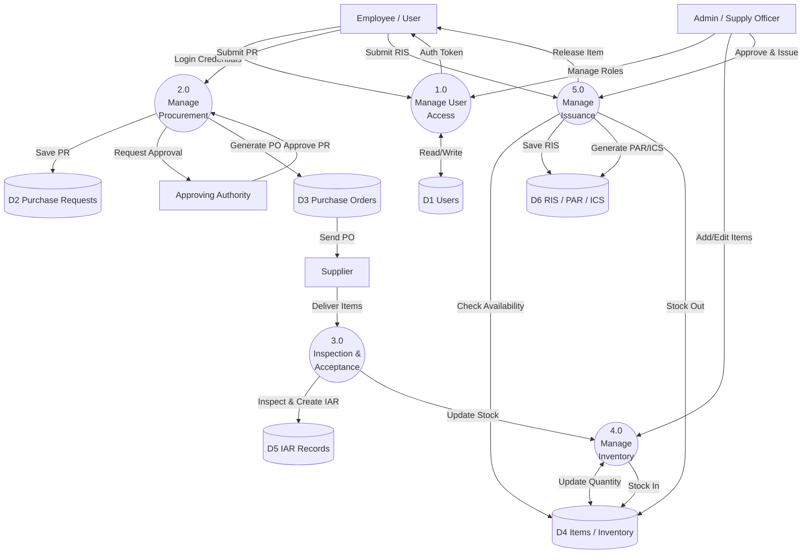

# Data Flow Diagrams (DFD) for Supply and Property Management System

## DFD Level 0 (Context Diagram)

```mermaid
graph TD
    %% Entities
    User[Employee / User]
    Admin[Admin / Supply Officer]
    Supplier[Supplier]
    Authority[Approving Authority]

    %% System
    System((0.0<br>Supply & Property<br>Management System))

    %% Flows
    User -->|Submit Purchase Request (PR)| System
    User -->|Submit Requisition Issue Slip (RIS)| System
    System -->|Issued Items & Acknowledgement Receipt (PAR/ICS)| User

    Admin -->|Manage Inventory & Users| System
    Admin -->|Generate Reports (IAR, PO, RIS)| System
    System -->|Notifications & Status Updates| Admin

    System -->|Purchase Order (PO)| Supplier
    Supplier -->|Delivery & Invoice| System

    System -->|Request for Approval (PR/PO)| Authority
    Authority -->|Approved PR/PO| System
```

## DFD Level 1 (System Decomposition)


